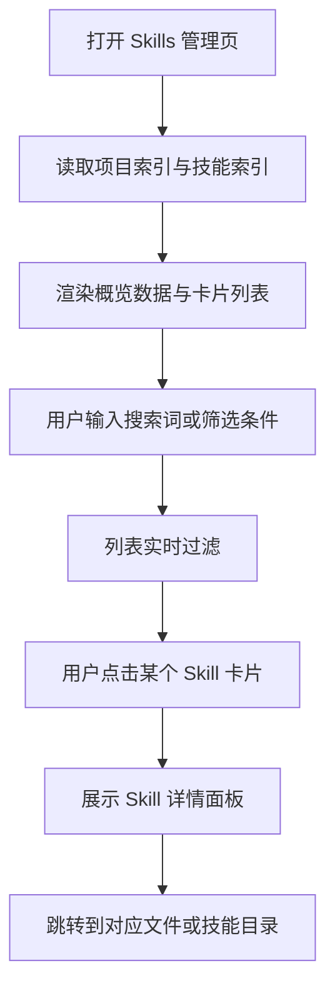

## 1. 产品概述
为 `SkillForge` 增加一个可视化的 skills 管理页面，以卡片式方式集中展示整个仓库中的 skill，帮助 AI 与人快速浏览、检索和理解每个 skill。
- 核心目标是把当前分散在业务目录、`registry/` 和各个 `skill.json` 中的 skill 信息集中成一个统一入口。
- 产品价值在于降低新 AI 或协作者的理解成本，让 skill 仓库从“文件系统浏览”升级为“可视化管理与检索”。

## 2. 核心功能

### 2.1 功能模块
1. **Skills 管理页**：项目概览、搜索筛选、skill 卡片列表、详情面板、快速跳转
2. **Skill 详情视图**：展示 skill 介绍、路径、平台支持、输入输出、规则与关键文件链接

### 2.2 页面详情
| 页面名称 | 模块名称 | 功能描述 |
|-----------|-------------|---------------------|
| Skills 管理页 | 顶部概览区 | 展示项目名、skill 总数、业务域数量、平台覆盖数 |
| Skills 管理页 | 搜索筛选区 | 按 skill 名称、展示名、业务路径、平台、类型搜索和过滤 |
| Skills 管理页 | 卡片列表区 | 以卡片方式展示 skill，显示名称、描述、业务路径、平台标签、是否可分发 |
| Skills 管理页 | 详情面板 | 点击卡片后展示 skill 详细介绍、输入输出、约束、关键文件入口 |
| Skills 管理页 | 文件快捷入口 | 快速跳到 `SKILL.md`、`README.md`、`skill.json`、`INVOCATION.md` |

## 3. 核心流程
用户打开页面后，先看到项目级概览，再通过搜索和筛选缩小范围；点击某个 skill 卡片后，在右侧或弹层中查看 skill 介绍和关键文件入口，进一步进入具体 skill 包。

## 4. 用户界面设计
### 4.1 设计风格
- 主色：低饱和灰白、石墨黑、雾蓝灰，强调中性和专业感
- 按钮风格：轻圆角、低对比边框、悬浮高亮，不使用突兀警告红
- 字体：中文优先系统中文字体，英文字段搭配简洁等宽或半等宽辅助显示
- 布局风格：桌面优先的管理台布局，上方概览，下方卡片网格，详情面板采用侧边抽屉或固定右栏
- 图标风格：极简线性图标，强调信息层级而不是装饰感

### 4.2 页面设计概览
| 页面名称 | 模块名称 | UI 元素 |
|-----------|-------------|-------------|
| Skills 管理页 | 顶部概览区 | 大标题、统计卡、项目说明、小型平台标签 |
| Skills 管理页 | 搜索筛选区 | 搜索框、筛选 chips、平台勾选、类型切换 |
| Skills 管理页 | 卡片列表区 | 响应式卡片网格、hover 状态、路径标签、平台标签、描述摘要 |
| Skills 管理页 | 详情面板 | 标题、说明、输入输出标签、规则列表、关键文件按钮 |

### 4.3 响应式
- 采用桌面优先设计
- 平板端缩减为两列卡片
- 小屏时详情面板切换为底部抽屉或整屏详情页

