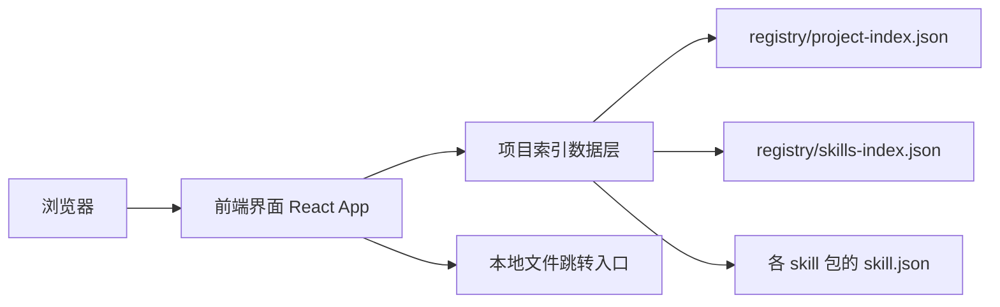
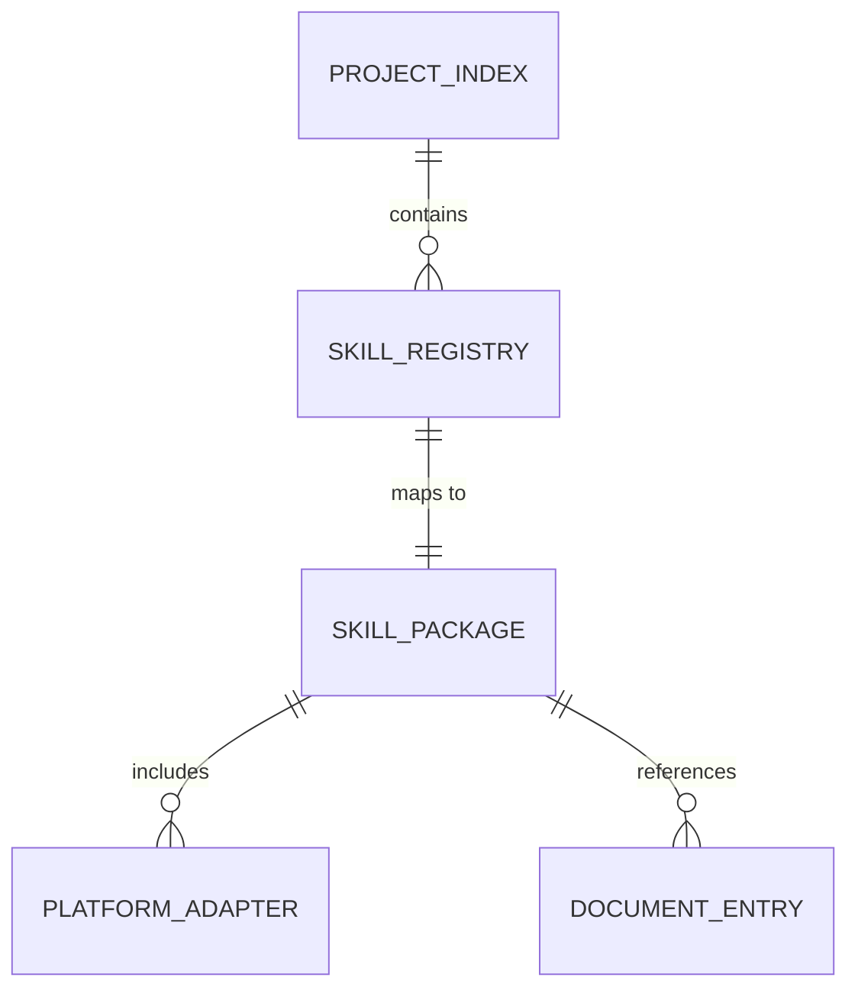

## 1. 架构设计



## 2. 技术描述
- 前端：React@18 + TailwindCSS@3 + Vite
- 初始化工具：Vite
- 数据来源：项目本地 `registry/*.json` 和各个 skill 包中的 `skill.json`
- 部署方式：先做本地静态页面，可通过 Vite 开发服务器预览

## 3. 路由定义
| 路由 | 用途 |
|-------|---------|
| / | Skills 管理首页，展示概览、检索、卡片列表与详情面板 |

## 4. API 定义
当前不引入后端 API，前端直接读取项目内静态 JSON 数据。

```ts
type SkillRegistryItem = {
  name: string;
  display_name: string;
  category_path: string[];
  package_root: string;
  portable: boolean;
  supported_platforms: string[];
  entrypoint: string;
};

type SkillPackageMeta = {
  name: string;
  display_name: string;
  type: string;
  scope: string;
  version: string;
  description: string;
  supported_platforms: string[];
  inputs: {
    required: string[];
    optional: string[];
  };
  outputs: string[];
  constraints: string[];
  implementation: Record<string, string>;
};
```

## 5. 数据模型
### 5.1 数据模型定义



### 5.2 数据定义说明
- `project-index.json`：项目级入口与分层导航
- `skills-index.json`：全局 skill 列表
- `skill.json`：单个 skill 的完整元数据
- 前端运行时将这些数据聚合为统一视图模型，用于渲染卡片和详情面板

## 6. 实现约束
- 页面应放在独立前端目录中，不污染现有 skill 包结构
- 页面必须优先复用当前项目索引文件，而不是手写技能数据
- 文件入口按钮优先使用本地文件链接格式，方便在 IDE 中直接跳转
- 页面风格保持中性、清爽、卡片式，不做花哨营销页
